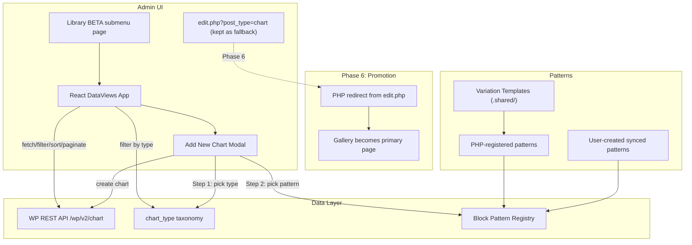

# Chart DataViews Gallery — Implementation Plan

> **Overview:** Build a DataViews-powered chart gallery on the existing "Library (BETA)" submenu page alongside the standard `edit.php` list table, add a `chart_type` taxonomy synced on save, implement an "Add New Chart" modal with a two-step flow (pick type, then pick pattern), and register variation templates as WordPress patterns. Once mature, promote the gallery to replace `edit.php` entirely.

## Current State

The chart builder plugin (`plugins/prc-chart-builder/`) registers a `chart` custom post type. The default admin list table at `edit.php?post_type=chart` is a standard WordPress list table. There is also a `Library (BETA)` submenu page at `includes/admin/` with a nascent DataViews implementation, its own `package.json`, and a separate build process.

Key existing pieces to leverage:

- **Block variation templates** at `.shared/variation-templates/` define ~20 chart types with default block content
- **`chartType` attribute** on the controller block (`src/controller/block.json`) stores the chart type as a string
- **`prc-chart-builder/chart` block schema** at `src/chart/block.json` is the source of truth for all chart attributes (~570 lines, fully typed with defaults)
- **Chart creation logic** in `src/synced-chart/chart-create.jsx` already creates charts via REST API from variations
- **Existing admin DataViews** at `includes/admin/src/` has hooks, fields, actions, and components to evolve

## Architecture Overview

---

## Phase 1: Foundation (Core Gallery on Library BETA page)

Build the DataViews gallery on the existing "Library (BETA)" submenu page. The standard `edit.php?post_type=chart` list table remains untouched as a stable fallback. This lets users test the new gallery while having a working admin at all times.

### 1a. Add `chart_type` taxonomy and sync on save

Register a private, non-hierarchical taxonomy `chart_type` for the `chart` post type. Add a `save_post_chart` hook that parses `post_content`, extracts the `chartType` attribute from the `prc-chart-builder/controller` block, and sets the taxonomy term accordingly. This enables server-side filtering.

**Files to modify:**

- `includes/class-content-type.php` — register taxonomy in `register_types()`, add `save_post` hook
- New method `sync_chart_type_on_save()` that uses `parse_blocks()` to find the controller block and extract `chartType`

Key consideration: the taxonomy should be `show_in_rest => true` for REST API filtering, but `show_ui => false` since users should not manually edit it. Terms are auto-created from the known chart type slugs.

### 1b. Backfill existing charts

A WP-CLI command to iterate all existing `chart` posts and set their `chart_type` taxonomy term based on parsed block content. This is a one-time migration.

**Files to modify:**

- `includes/class-wp-cli-commands.php` — add a `backfill_chart_types` subcommand

### 1c. Fix admin page render/enqueue

Clean up the existing Library (BETA) page infrastructure before building on top of it.

**Files to modify:**

- `includes/admin/class-admin.php`

Changes:

- Fix the HTML typo in `render_page()` (extra closing `
`)
- Remove `error_log` calls from `enqueue_assets()`
- Add `wp-components` stylesheet dependency
- Localize chart type data for the React app via `wp_localize_script`

### 1d. Build the DataViews gallery React app

Evolve the existing `includes/admin/src/` code into a full gallery.

**Data fetching** — Replace the current `useCharts` hook (which fetches 100 charts client-side) with a server-side approach. The `onChangeView` callback should translate the view state (page, perPage, sort, search, filters) into REST API query params and fetch accordingly. Use `@wordpress/core-data`'s `useEntityRecords` or a custom hook around `apiFetch`.

**Fields definition** — Expand `includes/admin/src/fields/index.js`:

- `preview` — placeholder icon per chart type for now (Phase 1), later featured image (Phase 4)
- `title` — chart title (`enableGlobalSearch: true`, `enableHiding: false`)
- `chartType` — derived from the `chart_type` taxonomy terms, with `elements` for filtering and `filterBy` config
- `author` — post author
- `date` — modified/published date
- `designSlug` — from post meta
- `status` — post status (draft/publish)

**Layout config** — Default to grid layout, with table as secondary:

- Grid: `mediaField` = `preview`, `primaryField` = `title`
- Table: standard column layout

**Actions** — Expand `includes/admin/src/actions/index.js`:

- Edit Chart (primary, navigates to block editor)
- View Chart (opens frontend)
- Duplicate Chart
- Move to Trash (`supportsBulk: true`)

**Styles** — Keep the existing approach of importing `@wordpress/dataviews/build-style/style.css` in `includes/admin/src/style.scss`, add `wp-components` as a style dependency.

---

## Phase 2: "Add New Chart" Modal ✅ COMPLETE

Build the two-step chart creation flow triggered from the gallery header.

### 2a. Pattern categories (not PHP-registered patterns) ✅

**Implemented:** `includes/class-chart-patterns.php` registers **pattern categories** only (one per chart type, e.g., `bar`, `sankey`, `map-usa`) via `register_block_pattern_category()`. Individual patterns are **not** PHP-registered — they are created and managed entirely by editors in the WordPress admin (Appearance → Editor → Patterns).

> **Key decision change from original plan:** PHP-registering variation templates as block patterns was abandoned. PHP-registered patterns are not reliably fetchable via REST API at the time `wp_localize_script` runs, and `/wp/v2/block-patterns/patterns` only returns code-registered patterns. Editor-created unsynced patterns stored as `wp_block` posts are fetched reliably at runtime.

### 2b. "Add New Chart" modal ✅

**Implemented** in `includes/admin/src/components/create-new-chart-modal.jsx`.

**Step 1 — Chart Type Picker:**
- Grid of cards with icon, label, and pattern count badge
- Sourced from `window.prcChartBuilderLibrary.chartTypeTerms` (localized from PHP)

**Step 2 — Pattern Picker (DataViews grid):**
- Fetches patterns at runtime via two concurrent REST calls: `/wp/v2/wp_pattern_category` (slug→ID map) and `/wp/v2/blocks?context=edit` (user-created `wp_block` posts)
- Filters client-side to only show patterns whose `wp_pattern_category` terms include the selected chart type slug
- Renders live `BlockPreview` previews (not placeholders) — same approach as the WordPress Site Editor patterns page
- **"Blank" card** always shown first — serializes the matching `.shared/variation-templates/` entry directly, no saved pattern needed
- Appearance → Preview Size slider is wired to `BlockPreview`'s `viewportWidth` via `view.layout.previewSize`

**Chart Creation:**
- Reuses `createBlocksFromInnerBlocksTemplate` + `serialize` (same as `chart-create.jsx`)
- POSTs to `/wp/v2/chart` with `status: draft`, redirects to `post.php?post={id}&action=edit`

### 2c. User-created chart patterns ✅

Users save patterns from the block editor ("Create pattern" → set sync to "Not synced" → assign category matching chart type slug). The pattern immediately appears in the modal's Step 2 picker without any PHP changes required.

---

## Phase 3: AI-Assisted Chart Creation

Add AI-powered input modes to the "Add New Chart" modal built in Phase 2. These appear as additional tabs alongside the manual type/pattern picker. The modal infrastructure and chart creation pipeline already exist — the AI just provides an alternative way to produce the same structured output.

### 3a. Define AI output schema subset and build proxy REST endpoint

**Output schema:** `src/chart/block.json` is the source of truth. The AI output should be a subset of its attributes — only the fields the AI needs to set (the rest fall back to defaults):

- `chartType` on the controller block (string matching variation names)
- `layout.type`, `layout.orientation`, `layout.width`, `layout.height`
- `metadata.title`, `metadata.subtitle`, `metadata.source`, `metadata.note`
- `colors` array
- `independentAxis` / `dependentAxis` overrides (domain, tickCount, label formatting)
- `labels.active`, `legend.active`
- Type-specific config (e.g., `bar.barPadding`, `line.interpolation`, `pie.innerRadius`)
- Data table content (the `prc-block/table` inner block with header and body cells)

**REST endpoint:** `/prc-chart-builder/v1/ai/generate` that:

- Accepts either an image (base64 or upload) or a text description
- Forwards to a multimodal LLM with the output schema and chart builder context
- Returns the structured chart definition
- Handles API key management (stored as a WordPress option, not in code)
- Includes rate limiting and error handling

For prototyping, Google Gemini offers a generous free tier with vision support. For production, Claude or GPT-4o via a proxied endpoint.

### 3b. Build the AI input UI in the Add New modal

Two new input modes added as tabs in the Phase 2 modal:

**Image-to-Chart:**

- Drop zone for PNG/JPG chart images
- Sends to AI endpoint, shows loading state
- Displays the AI's interpretation: detected chart type, extracted data preview, proposed configuration
- User confirms or adjusts before creating the chart post

**Text-to-Chart:**

- Text area for natural language chart descriptions (e.g., "horizontal bar chart showing broadband adoption: US 92%, UK 96%, Germany 91%, France 84%")
- Sends to AI endpoint, shows loading state
- Same confirmation/adjustment step

Both modes produce the same structured output, which feeds into the existing `chart-create.jsx`-style creation logic: serialize to blocks, POST to REST API, redirect to editor.

### 3c. Prompt engineering with variation templates as few-shot examples

The system prompt for the LLM should include:

- The output schema subset with field descriptions
- Examples of each chart type's typical attribute configuration drawn from `.shared/variation-templates/` — ideal few-shot examples
- PRC's design conventions (color palettes, font choices, standard dimensions)
- Instructions to err on the side of simplicity (fewer data points, clean labels)

This context could be maintained as a template file composed with the user's input at request time.

**Key considerations:**

- Accuracy target: 50–80% fidelity. The AI produces a solid starting point; users refine in the block editor.
- Cost: vision analysis is more expensive than text-to-chart. Consider caching or limiting calls.
- Start with bar, line, column (the most common types) and expand coverage over time.
- API key management and cost tracking need to be resolved before production use.

---

## Phase 4: Visual Previews ✅ COMPLETE

Replace placeholder icons with live block previews in the gallery cards.

### Implemented approach (differs from original plan)

Rather than generating PNG thumbnails, the gallery now renders live `BlockPreview` components directly in each card — the same technique used in the WordPress Site Editor patterns page.

**How it works:**
- `DataViews` component (`includes/admin/src/components/dataviews.jsx`) is wrapped in a `BlockEditorProvider` to bootstrap the block editor Redux store
- The `preview` field in `includes/admin/src/fields/index.js` exports a `ChartPreviewField` component that calls `parse(item.content.raw)` and renders `<BlockPreview blocks={blocks} viewportWidth={viewportWidth} />`
- `viewportWidth` is derived from `view.layout.previewSize` (the DataViews Appearance slider) via a lookup table matching DataViews' six discrete snap values (120–430px)
- Falls back to a chart-type icon if `content.raw` is empty
- CSS on `.dataviews-view-grid__media`: `overflow: hidden` clips the scaled iframe; `.block-editor-block-preview__content { position: absolute }` aligns the preview within its container

**Block asset loading (required for previews to work):**
`class-admin.php` enqueues `wp-block-library` + all registered block types' editor scripts and styles via `WP_Block_Type_Registry`. `src/index.js` calls `registerCoreBlocks()` so core blocks are available in the JS registry on this non-editor admin page.

> **Original plan** called for featured images — deferred indefinitely since live previews are more accurate and require no server-side rendering infrastructure.

---

## Phase 5: Polish and Extended Features

- **CSV drop-to-create** — Evolve the existing `DropZone` component to create a chart from dropped CSV data
- **Bulk actions** — Bulk delete, bulk change chart type, bulk duplicate
- **Keyboard navigation** — Ensure full keyboard accessibility through the gallery
- **URL state** — Persist view state (filters, sort, page) in URL query params so views are shareable/bookmarkable
- **Search** — Wire up the DataViews search to the existing `design_slug` meta search capability

---

## Phase 6: Promote Gallery to Primary

Once the gallery is mature, battle-tested, and feature-complete:

- Redirect `edit.php?post_type=chart` to the gallery page via a `load-edit.php` hook
- Rename the submenu item from "Library (BETA)" to "All Charts"
- Make the gallery the first submenu item under Charts
- Remove the default "All Charts" submenu that points to `edit.php`
- Optionally adjust `show_in_menu` on the post type registration

**Files to modify:**

- `includes/admin/class-admin.php` — redirect logic, menu reordering
- `includes/class-content-type.php` — potentially adjust post type `show_ui` / `show_in_menu` args

---

## Key Technical Decisions

- **Taxonomy over post meta for chart type filtering** — A taxonomy is more WordPress-native for filtering in REST API queries (`?chart_type=bar`). It auto-generates REST filter params. We still sync on save since the source of truth is the block attribute.
- **`src/chart/block.json` as AI schema source** — The existing, fully-typed attribute schema is the AI output contract. No new schema definition needed.
- **Server-side pagination** — Necessary for scale. The DataViews `onChangeView` callback translates view state to REST params.
- **Separate sub-package** — Keep `includes/admin/` as its own package with `@wordpress/scripts` build, matching the existing architecture. It has its own `@wordpress/dataviews` dependency and build process, separate from the main plugin block builds.
- **Pattern-based templates** — Using the WordPress pattern system means templates are composable, versionable, and users can create their own. The variation templates become the "default" patterns, and users can add more.
- **AI as a "starter" not "finisher"** — The AI chart creation aims for 50–80% accuracy, producing a solid draft that users refine. This keeps the problem tractable and sets appropriate expectations.
