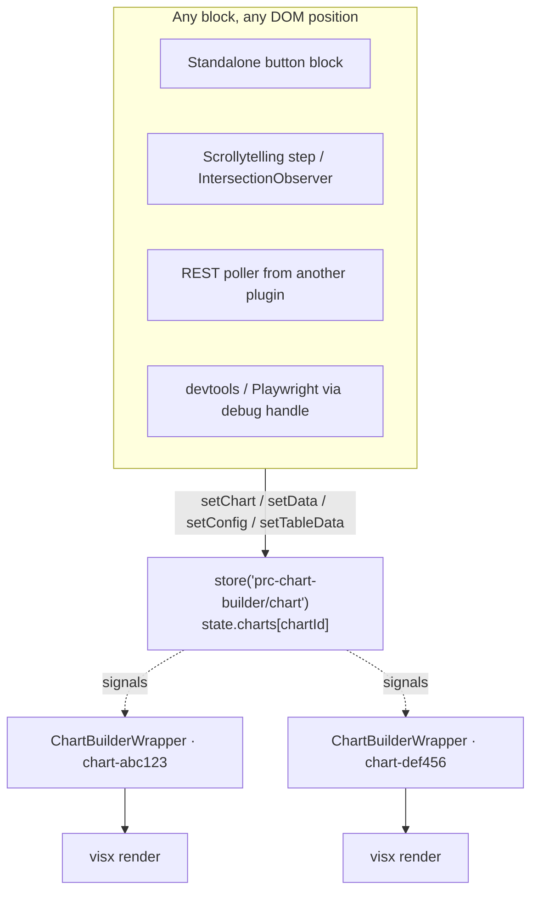

# Reactive chart store (PRC-17)

How any block on the page — a sibling, a sticky sidebar, a scrollytelling step,
a totally separate plugin — drives a chart's data and config at runtime, and how
chart components subscribe to those updates.

This is the author-facing companion to [`console-helpers.md`](console-helpers.md)
(the devtools/`debug` surface). If you just want to poke a chart from the console,
start there. Read this when you're building a **consumer block** that updates a
chart, or working **inside the charting library** on a component that needs live
store data.

## The big picture

The frontend chart bundle is a Preact [Script Module](https://make.wordpress.org/core/2024/03/04/script-modules-in-6-5/)
(`@prc/charting-library`) that bridges to an `@wordpress/interactivity` store. The
editor keeps using the unchanged React build. Same source, two webpack outputs:

| Build | Output | Runtime | Store |
| --- | --- | --- | --- |
| Editor | `build/editor.js` (classic script handle `prc-charting-library`) | React | none — `useChartStore` is a no-op returning `undefined`; components fall back to inline props |
| Frontend | `build/view.js` (Script Module `@prc/charting-library`) | Preact via `preact/compat` | `prc-chart-builder/chart` interactivity store |



## Addressable per-chart store

Every chart instance has a stable **`chartId`** — the chart block's own `id`
attribute, set in the editor to `${controllerId}-chart`. It is emitted on the
frontend as `data-prc-chart-id` on the chart wrapper element, and it is the key
into the store:

```ts
store('prc-chart-builder/chart').state.charts[chartId] = {
    data,             // ChartDatum[] — the plotted rows
    tableData,        // underlying-numbers table (or null)
    attributes,       // block attributes (unchanged)
    config,           // resolved chart config; undefined until the chart mounts, then populated
    currentViewport,  // 'mobile' | 'tablet' | 'desktop'
    isQuestionExpanded,
    shouldRender,
    chartHash,
    iframeHeight,
}
```

There is **one** store namespace (`prc-chart-builder/chart`) and **one** state
tree. A chart with no external callers (the ~95% case) reads its slice once on
mount and never sees another mutation — the subscription is effectively free.

To discover ids on a page: every chart wrapper carries `data-prc-chart-id`, so
`document.querySelectorAll('[data-prc-chart-id]')` (or
`prcChartingLibrary.debug.listCharts()`) enumerates them.

## Action surface

Four actions live on the `prc-chart-builder/chart` store. `setChart` is the
load-bearing primitive; the other three are thin single-field wrappers around it.

```ts
import { store } from '@wordpress/interactivity';
const { actions } = store('prc-chart-builder/chart');

actions.setChart(chartId, { data?, config?, tableData? }); // atomic — one re-render
actions.setData(chartId, data);                            // → setChart(id, { data })
actions.setConfig(chartId, partialConfig);                 // → setChart(id, { config })
actions.setTableData(chartId, tableData);                  // → setChart(id, { tableData })
```

**Field semantics** (implemented by `applyChartPatch` / `applyDeepPatch` in
[`plugins/prc-chart-builder/src/chart/utils/apply-deep-patch.js`](../src/chart/utils/apply-deep-patch.js)):

- `data` and `tableData` **replace wholesale**.
- `config` **deep-merges**: object branches merge per-key (siblings preserved);
  arrays replace wholesale (`colors`, `dataRender.categories`, …). The one
  exception is `annotations.items`, which merges per-index so you can patch a
  single annotation — see [`console-helpers.md`](console-helpers.md).

### Why `setChart` is the correctness primitive

`setChart` applies every provided field in **one synchronous pass** before it
returns, so preact-signal batching collapses the change into a single
`useSyncExternalStore` re-render. Use it whenever a single logical update touches
more than one field — especially a dataset swap that changes the **category
universe**. Independent `setData` + `setConfig` calls can briefly expose a torn
`(data, categories, colors)` triple (new data, stale colors) before the second
call lands. `setChart` makes that impossible.

> Rule of thumb: changing only values within an existing shape → `setData` is
> fine. Changing which categories/series exist → `setChart` with both `data` and
> `config` in the same call.

### `tableData` fans out to three surfaces

`tableData` is a lossy `{ header: string[], rows: string[][] }` projection of
the chart's underlying-numbers table. The chart slice
(`state.charts[chartId].tableData`) is the **single source of truth**, and three
surfaces derive from it — so one `setTableData` (or `setChart({ tableData })`)
updates all three:

| Surface | How it consumes the slice |
| --- | --- |
| Chart ARIA description | `useChartStore` → `getAria` inside the chart tree (reactive). |
| Visible "underlying numbers" table | `controller/view.js`'s `watchChart` `watch`es the slice and updates the cell content of the server-rendered `.chart-builder-data-table` in place. |
| CSV export | `controller/view.js`'s `downloadData` reads the slice (falling back to the server-seeded controller `context.tableData` for freeform charts). |

The visible table is **server-rendered by the real Power Table block**
(`render_block` in
[`plugins/prc-chart-builder/src/controller/class-controller.php`](../src/controller/class-controller.php)),
so the no-JS first paint carries every author formatting choice — column widths,
scroll-on-overflow, sticky column, sorting, rounding. Layout lives in the block
markup, **not** in the projection; the `{ header, rows }` projection only drives
cell **content**.

The projection is derived from that **rendered** markup (not the raw saved
`innerHTML`), so `tableData` / CSV / ARIA reflect exactly what is displayed —
e.g. a column rounded to 0 decimals projects `31`, not the stored `30.7`.

On a live update the client `watch` takes over and patches **content only**:
`rebuildDataTable` rewrites the `innerHTML` of the existing, non-hidden cells (so
all element-level formatting is preserved) and never rebuilds rows or cells. It
is deliberately strict — an update is applied only when its shape matches the
rendered table exactly (same row count, same visible-column count per row);
any mismatch is ignored with a dev-console warning, leaving the correct server
render in place. **Reshaping the table (adding/removing rows or columns) is
unsupported by design**, as is the parser's existing rectangular contract
(single header row, `<th>` headers, `<td>` body cells, no `colspan`/`rowspan`).
Consumers must send the same structure with production-ready values — "copy the
current `tableData`, change some values". Charts that ship with no table block
have no CSV button or table container to update.

### Metadata text live-updates too

`config.metadata.{ title, subtitle, note, source, tag }` is mirrored onto the
controller's server-rendered metadata elements (`.cb__title`, `.cb__subtitle`,
`.cb__note--note`, `.cb__note--source`, `.cb__tag`) by the same
`callbacks.watchChart` init in
[`controller/view.js`](../src/controller/view.js). Patch it through
`setConfig(chartId, { metadata: { title } })` (or `setChart`); the deep-merge
preserves sibling metadata. Every match in the controller subtree is updated —
metadata renders in up to three places (the chart block, the data-tab table, the
freeform wrapper). Values are written via `innerHTML` to match the server's
`wp_kses_post` output. Note that `metadata.title` is **not** rendered inside the
chart SVG itself (only `metadata.alt` feeds ARIA), and the controller's static
header title is the surface this updates.

### Surviving client-side navigation

The live slice is the single source of truth, but the Interactivity Router does
**not** refresh it on navigation. `@wordpress/interactivity`'s
`populateServerData` merges the new page's server state with
`deepMerge(state, serverState, override = false)`, so any leaf already present in
`state.charts[chartId]` (`data`, `config`, `tableData`, `attributes`) keeps its
mount-time value — only `getServerState()` reflects the navigated payload.

Left alone, that produces a split: the chart graphic lives in its own
`data-wp-router-region`, so the router re-patches it directly and it updates,
while the controller's table and metadata read the live slice and would stay
frozen at their first-paint values.

`view.js`'s `syncOnNavigation` callback closes the gap. Because
`getServerState()` is reactive to the router's navigation signal, the callback
re-runs after every navigation, re-derives `(data, config, tableData)` from the
fresh server payload via `buildChartInputs`, and writes them back onto
`state.charts[chartId]`. Those top-level writes flow through the same signals the
wrapper and the controller `watch`es already subscribe to, so the chart, table,
and metadata all reconverge on the navigated chart. The first (mount) pass is
skipped per chart id — `renderChart` already seeds the slice then.

This reuses the runtime update path, so a navigation and a `setData` /
`setTableData` call drive the same machinery rather than two parallel ones. (An
earlier alternative — giving the controller its own router region — was rejected
because the chart region nests inside the controller, so re-rendering the
controller would clobber the client-mounted chart, and it still wouldn't serve
the runtime action surface.)

## Data ↔ config coupling contract

Categories are **column keys bound positionally**. `config.dataRender.categories`
(and, for diverging charts, `divergingBar.positive/negativeCategories`) is the
domain for both the series band scale and the `scaleOrdinal` color scale, with
`config.colors` zipped **by index**. Consequences for callers:

- **A category is born in config, not data.** `setData` fills/replaces values for
  already-declared categories; it does not introduce new series. Declare the full
  category universe up front in both the initial data and the relevant config
  arrays.
- **Adding a category live is a coordinated config+data change** — do it through
  `setChart` so it is atomic.
- **Array fields replace wholesale.** Patching `dataRender.categories` means
  resending its lockstep `colors` array in the **same** patch (or via `setChart`).
- **Diverging is config-only by design.** Positive/negative classification is
  never data-derivable; it's recomputed at render from `negativeCategories`. To
  move a category across the axis, resend **both** `negativeCategories` and
  `positiveCategories` together — a category in neither array is invisible.
- **Null-seeding is bar-family-specific.** For bar/stacked/diverging charts a
  `null` value renders as a zero bar that reserves the color slot, legend entry,
  and a stable animation key. For line/area a `null` is a gap; for pie it's a
  missing wedge — those families reserve slots via config, not via null rows.

## Color model — forward-compatibility contract

PRC-17 does **not** rewrite color. There are **four distinct color models**, and a
single category-keyed `colorMap` would be the wrong model for maps. Every family
already has a working color setter today via the generic action surface:
`setConfig({ colors: [...] })` (array-replace) recolors any chart; maps
additionally take `dataRender.mapScaleDomain`.

| Family | Components | Color-domain identity | "Set colors" today |
| --- | --- | --- | --- |
| Config-category-keyed | Bar V/H, StackedBar V/H, ExplodedBar, DotPlot, Line, StackedArea | `dataRender.categories` | resend positional `colors` |
| Diverging | DivergingBar V/H (+ neutral/secondary) | category incl. neutral/secondary keys | resend `colors`; sides via `negative/positiveCategories` (both, atomically) |
| Data-derived | Pie, Radar, Treemap, Sankey, grouped Scatter | runtime data value / node / group name | resend `colors`; keyed override rides `resolveCategoryColor` (Sankey already does) |
| Value-binned (maps) | AlbersUSA, …Counties, …CBSA, BlockUSA, HexUSA, World | value bins (`dataRender.mapScaleDomain`) | resend the **ordered** `colors` ramp + `mapScaleDomain` — order *is* the semantics |

Three guardrails for any future work:

1. Shape any future keyed override by **color-domain identity**, not "category."
2. All per-mark color flows through
   [`resolveCategoryColor`](../../prc-scripts/includes/scripts/src/@prc/charting-utilities/utilities/resolveCategoryColor.ts)
   with `fallback = base scale`. New animated/reactive components must **not**
   bypass it.
3. `colors` (+ `mapScaleDomain`) stays the canonical positional/ramp input for
   every family. A keyed override only rides on top where a key matches.

**Deferred (demand-driven, not built):** a keyed per-key color override. When the
first consumer block needs it, two small edits land it non-breaking — a
`dataRender.colorOverrides?.[key] ?? fallback` branch in `resolveCategoryColor`
plus a per-family seed in `getConfig`. No `buildColorScale`; maps untouched.

## Subscribing inside the library: `useChartStore`

Chart components read live store data through the
[`useChartStore`](../../prc-charting-library/src/lib/hooks/useChartStore.ts) hook. You normally don't call
it directly — `ChartBuilderWrapper` does, and falls back to inline
`data`/`config`/`tableData` props when it returns `undefined`. Reach for it only
when building a new component that needs its own live store slice.

```ts
import { useChartStore } from '@prc/charting-library';

const slice = useChartStore('prc-chart-builder/chart', chartId);
// Preact frontend build → live slice proxy; re-renders on any tracked mutation.
// React editor build      → always undefined (interactivity isn't loaded).
```

How it works, and the gotchas baked into the implementation:

- It bridges across **two separate preact runtimes** (the chart Script Module and
  `@wordpress/interactivity` each bundle their own). Tracking is done with
  interactivity's `watch` (its re-export of `@preact/signals`'s `effect`), owned
  by interactivity's runtime — so we do **not** rely on the implicit
  `options.diffed` integration that would require a shared instance.
- `useSyncExternalStore` reads a **version counter**, not the slice ref. The slice
  is a stable Proxy whose ref never changes, so a reference compare would never
  re-render. The version is bumped inside the `watch` callback.
- **`config` is deep-tracked; everything else is top-level.** `setData` /
  `setTableData` / the mount replace their prop wholesale, so a top-level read
  subscribes correctly. `setConfig` mutates nested config paths *in place*
  (`config.colors`, `config.axis.x.*`), so the hook walks the whole config subtree
  to subscribe at every path the deep-merge can touch. If you add a component that
  reacts to nested mutations on some *other* slice prop, you'll need to extend the
  tracking the same way.
- **Editor swap:** webpack `resolve.alias` points `./hooks/useChartStore` at
  [`useChartStore.editor.ts`](../../prc-charting-library/src/lib/hooks/useChartStore.editor.ts) in the
  editor config, so `@wordpress/interactivity` is never imported into the editor
  bundle.

A subtle watch-callback hazard worth knowing: the interactivity runtime
auto-subscribes a `watch`/callback to **every signal it reads**. The
`watchForRender` callback in `view.js` deliberately reads *only* `shouldRender` —
reading `.data` there would make `setData` re-trigger `renderChart`, which would
overwrite the just-mutated slice from the immutable server payload.

## Consumer-block recipes

The architecture supports these today; the blocks themselves are out of scope for
PRC-17 (separate tickets). Adapt these snippets.

### Standalone button anywhere on the page

```html
<button
    data-wp-interactive="prc-chart-builder/chart"
    data-wp-on--click="actions.setDataFromButton"
    data-prc-chart-id="chart-abc123"
    data-prc-payload='[ ... new dataset, serialized ... ]'
>2010</button>
```

```js
import { store, getElement } from '@wordpress/interactivity';

store('prc-chart-builder/chart', {
    actions: {
        setDataFromButton() {
            const { ref } = getElement();
            const data = JSON.parse(ref.dataset.prcPayload);
            // Same-shape data → setData. If the payload changes the category
            // universe, build a config patch and use actions.setChart instead.
            store('prc-chart-builder/chart').actions.setData(
                ref.dataset.prcChartId,
                data
            );
        },
    },
});
```

### Sticky-chart scrollytelling step (IntersectionObserver)

```html
<div
    data-wp-interactive="prc-chart-builder/chart"
    data-wp-init="callbacks.observeStep"
    data-prc-chart-id="chart-abc123"
    data-prc-payload='[ ... alternate data for this scroll position ... ]'
>By 2020…</div>
```

```js
import { store, getElement } from '@wordpress/interactivity';

store('prc-chart-builder/chart', {
    callbacks: {
        observeStep() {
            const { ref } = getElement();
            const observer = new IntersectionObserver(
                ([entry]) => {
                    if (entry.isIntersecting && entry.intersectionRatio > 0.5) {
                        const data = JSON.parse(ref.dataset.prcPayload);
                        store('prc-chart-builder/chart').actions.setData(
                            ref.dataset.prcChartId,
                            data
                        );
                    }
                },
                { threshold: [0, 0.5, 1] }
            );
            observer.observe(ref);
        },
    },
});
```

### REST poller from another plugin (no DOM directives)

```js
import { store } from '@wordpress/interactivity';

const chart = store('prc-chart-builder/chart');

setInterval(async () => {
    const fresh = await fetch('/wp-json/my-plugin/v1/latest').then((r) =>
        r.json()
    );
    // Atomic when the poll can change categories; setData when only values move.
    chart.actions.setChart('chart-abc123', {
        data: fresh.data,
        config: { colors: fresh.colors },
    });
}, 30_000);
```

## Verifying without building a UI

`window.prcChartingLibrary.debug` mirrors the action surface
(`setChart`/`setData`/`setConfig`/`setTableData`) and adds read primitives
(`getChart`, `listCharts`) plus `randomize` / `prcChartUpdate`. Full reference and
merge-rule examples in [`console-helpers.md`](console-helpers.md). The
render-count instrument `window.__PRC_CHART_RENDER_COUNTS__` lets you assert
`setChart` atomicity (one render per atomic update) from devtools or Playwright.

## Follow-up: `prc-custom-charts` dual build

`prc-custom-charts` has **not** been migrated to the dual React/Preact build — it
is a separate ticket, and this work is the template for it. In the interim the
fallback keeps working via the **window-global compat shim**: the Preact bundle
assigns its exports to `window.prcChartingLibrary` at the end of evaluation
([`src/view.js`](../../prc-charting-library/src/view.js)), and `prc-chart-builder`'s `view.js` resolves the
renderer as `window.prcCustomCharts ?? { ChartBuilderRenderer: ScriptModuleRenderer }`
— so `prc-custom-charts` still wins when present. When migrating it, follow the
slice 1→2 pattern here: array webpack config, `preact/compat` aliasing, a
`src/view.js` Script Module entry, and a `requestToExternalModule` entry in the
repo-root [`dependency-extraction.js`](../../../dependency-extraction.js).
