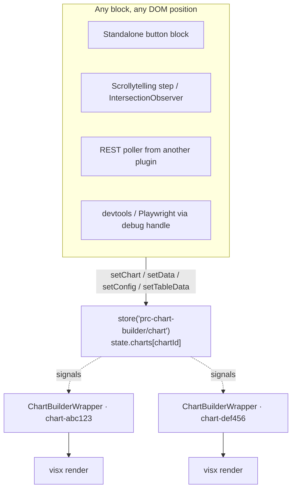
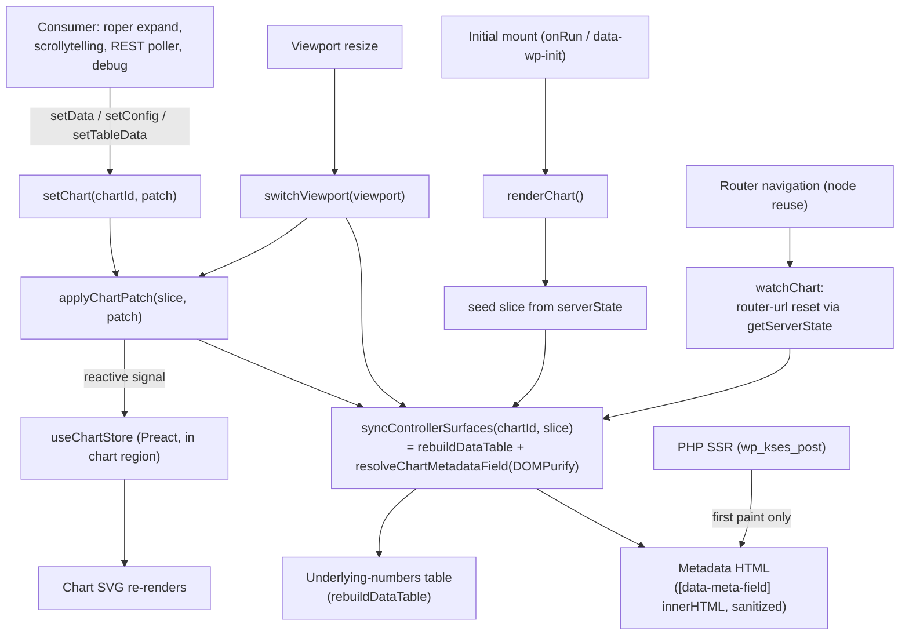

# Reactive chart store (PRC-17)

How any block on the page — a sibling, a sticky sidebar, a scrollytelling step,
a totally separate plugin — drives a chart's data and config at runtime, and how
chart components subscribe to those updates.

This is the author-facing companion to [`console-helpers.md`](console-helpers.md)
(the devtools/`debug` surface). If you just want to poke a chart from the console,
start there. Read this when you're building a **consumer block** that updates a
chart, or working **inside the charting library** on a component that needs live
store data.

## The big picture

The frontend chart bundle is a Preact [Script Module](https://make.wordpress.org/core/2024/03/04/script-modules-in-6-5/)
(`@prc/charting-library`) that bridges to an `@wordpress/interactivity` store. The
editor keeps using the unchanged React build. Same source, two webpack outputs:

| Build | Output | Runtime | Store |
| --- | --- | --- | --- |
| Editor | `build/editor.js` (classic script handle `prc-charting-library`) | React | none — `useChartStore` is a no-op returning `undefined`; components fall back to inline props |
| Frontend | `build/view.js` (Script Module `@prc/charting-library`) | Preact via `preact/compat` | `prc-chart-builder/chart` interactivity store |



## Addressable per-chart store

Every chart instance has a stable **`chartId`** — the chart block's own `id`
attribute, set in the editor to `${controllerId}-chart`. It is emitted on the
frontend as `data-prc-chart-id` on the chart wrapper element, and it is the key
into the store:

```ts
store('prc-chart-builder/chart').state.charts[chartId] = {
    data,             // ChartDatum[] — the plotted rows
    tableData,        // underlying-numbers table (or null)
    attributes,       // block attributes (unchanged)
    config,           // resolved chart config; undefined until the chart mounts, then populated
    currentViewport,  // 'mobile' | 'tablet' | 'desktop'
    isQuestionExpanded,
    shouldRender,
    chartHash,
    iframeHeight,
}
```

There is **one** store namespace (`prc-chart-builder/chart`) and **one** state
tree. A chart with no external callers (the ~95% case) reads its slice once on
mount and never sees another mutation — the subscription is effectively free.

To discover ids on a page: every chart wrapper carries `data-prc-chart-id`, so
`document.querySelectorAll('[data-prc-chart-id]')` (or
[`prcChartBuilder.debug.listCharts()`](../src/debug/index.js)) enumerates them.

## Action surface

Four actions live on the `prc-chart-builder/chart` store. `setChart` is the
load-bearing primitive; the other three are thin single-field wrappers around it.

```ts
import { store } from '@wordpress/interactivity';
const { actions } = store('prc-chart-builder/chart');

actions.setChart(chartId, { data?, config?, tableData? }); // atomic — one re-render
actions.setData(chartId, data);                            // → setChart(id, { data })
actions.setConfig(chartId, partialConfig);                 // → setChart(id, { config })
actions.setTableData(chartId, tableData);                  // → setChart(id, { tableData })
```

**Field semantics** (implemented by `applyChartPatch` / `applyDeepPatch` in
[`plugins/prc-chart-builder/src/chart/utils/apply-deep-patch.js`](../src/chart/utils/apply-deep-patch.js)):

- `data` and `tableData` **replace wholesale**.
- `config` **deep-merges**: object branches merge per-key (siblings preserved);
  arrays replace wholesale (`colors`, `dataRender.categories`, …). The one
  exception is `annotations.items`, which merges per-index so you can patch a
  single annotation — see [`console-helpers.md`](console-helpers.md).

### Why `setChart` is the correctness primitive

`setChart` applies every provided field in **one synchronous pass** before it
returns, so preact-signal batching collapses the change into a single
`useSyncExternalStore` re-render. Use it whenever a single logical update touches
more than one field — especially a dataset swap that changes the **category
universe**. Independent `setData` + `setConfig` calls can briefly expose a torn
`(data, categories, colors)` triple (new data, stale colors) before the second
call lands. `setChart` makes that impossible.

> Rule of thumb: changing only values within an existing shape → `setData` is
> fine. Changing which categories/series exist → `setChart` with both `data` and
> `config` in the same call.

## One update funnel

The chart SVG updates **reactively** via `useChartStore` inside the chart
region. Server-rendered surfaces — the underlying-numbers table and metadata
text — update **imperatively** through a single helper,
[`syncControllerSurfaces`](../src/chart/utils/sync-controller-surfaces.js),
invoked from `setChart`, `switchViewport`, and `renderChart`.



**Key invariant:** the table and metadata each have exactly **one runtime
writer** — `syncControllerSurfaces` — for same-page mutations. PHP SSR provides
first paint; after mount the funnel owns those surfaces. The controller's
`watchChart` callback reconciles both table and metadata after Interactivity
Router navigation using `getServerState()` as the source of truth (not the live
store slice, which may retain stale data per `populateServerData` `override = false`
semantics).

Metadata no longer uses per-field `data-wp-watch` callbacks; `config.metadata`
only mutates through `applyChartPatch` or the wholesale config seed, both of
which run through the funnel. The chart block is registered with
`parent: ["prc-chart-builder/controller"]`, so metadata scoping normally finds
`.wp-chart-builder-wrapper`; the funnel falls back to
`.wp-block-prc-chart-builder-chart` when no controller wrapper is present.

### `tableData` fans out to three surfaces

`tableData` is a lossy `{ header: string[], rows: string[][] }` projection of
the chart's underlying-numbers table. The chart slice
(`state.charts[chartId].tableData`) is the **single source of truth**, and three
surfaces derive from it — so one `setTableData` (or `setChart({ tableData })`)
updates all three:

| Surface | How it consumes the slice |
| --- | --- |
| Chart ARIA description | `useChartStore` → `getAria` inside the chart tree (reactive). |
| Visible "underlying numbers" table | `syncControllerSurfaces` → [`rebuildDataTable`](../src/controller/utils/rebuild-data-table.js) patches the server-rendered `.chart-builder-data-table` in place (`setChart`, `switchViewport`, `renderChart`). After Interactivity Router navigation, `watchChart` reconciles via `syncControllerSurfaces` using `getServerState()`. |
| CSV export | `controller/view.js`'s `downloadData` reads the slice (falling back to the server-seeded controller `context.tableData` for freeform charts). |

The visible table is **server-rendered by the real Power Table block**
(`render_block` in
[`plugins/prc-chart-builder/src/controller/class-controller.php`](../src/controller/class-controller.php)),
so the no-JS first paint carries every author formatting choice — column widths,
scroll-on-overflow, sticky column, sorting, rounding. Layout lives in the block
markup, **not** in the projection; the `{ header, rows }` projection only drives
cell **content**.

The projection is derived from that **rendered** markup (not the raw saved
`innerHTML`), so `tableData` / CSV / ARIA reflect exactly what is displayed —
e.g. a column rounded to 0 decimals projects `31`, not the stored `30.7`.

On a live update, same-page mutations go through
[`syncControllerSurfaces`](../src/chart/utils/sync-controller-surfaces.js) inside
`setChart` / `switchViewport` / `renderChart`. After Interactivity Router
navigation, `watchChart` reconciles both table and metadata via
`syncControllerSurfaces` using `getServerState()` (see [One update
funnel](#one-update-funnel) above).

[`rebuildDataTable`](../src/controller/utils/rebuild-data-table.js) logic:

- **Same shape** (row count and visible column count unchanged) → patch existing
  cell `innerHTML` only (preserves Power Table formatting).
- **Row count change** → rebuild `<tbody>` in place, keep the header row.
- **Column count change** → rebuild `<thead>` and `<tbody>`.

Hidden columns (`is-column-hidden`) are ignored when comparing shape. The
projection still assumes a rectangular table (single header row, `<th>` headers,
`<td>` body cells).

Charts that ship with no table block have no CSV button or table container to
update.

### Metadata text live-updates too

`config.metadata.{ title, subtitle, note, source, tag }` (plus viewport
overrides merged via [`resolveChartMetadata`](../src/chart/utils/resolve-metadata.js))
is mirrored onto server-rendered `[data-meta-field]` elements by
`syncControllerSurfaces` — called from `setChart`, `switchViewport`, and
`renderChart`. Patch through `setConfig(chartId, { metadata: { title } })`
(or `setChart`); the deep-merge preserves sibling metadata. Values are
sanitized with DOMPurify before writing `innerHTML`. SSR (`wp_kses_post`) still
provides first paint; the funnel is the sole runtime writer after mount.
Note that `metadata.title` is **not** rendered inside the chart SVG itself
(only `metadata.alt` feeds ARIA).

### Viewport switching (client-side)

Tablet/mobile attribute overrides are applied **in the browser** on window
resize using Gutenberg breakpoints (`< 480px` mobile, `480–781px` tablet,
`≥ 782px` desktop) — the same thresholds as the block editor device preview.
There is no per-chart `data-wp-router-region`, no `cb_viewport` query param,
and no Interactivity Router round-trip for breakpoints.

1. First paint: PHP detects device via `get_current_device()` and merges
   viewport attributes for SSR only; the Interactivity store seeds **unmerged**
   base attributes plus `currentViewport`.
2. On resize: `callbacks.watchForResize` (debounced) calls `switchViewport`,
   which re-derives `(data, config, tableData)` from base attributes +
   `currentViewport` and **wholesale-replaces** the live slice (not deep-merge —
   deep-merge would leave stale nested keys like `shapes.customStyles` from the
   previous breakpoint).

**File**: [`src/chart/view.js`](../src/chart/view.js)

### Client-side navigation (Interactivity Router)

**Standard Pew Research articles** (chart CPT embedded in a post via
`prc-chart-builder/controller`) do **not** rely on Interactivity Router for
chart lifecycle. Article-to-article navigation is a full page load; viewport
changes use client-side `switchViewport` (above). Removing the per-chart router
region and the old `syncOnNavigation` callback is intentional for this path.

**Parent router regions** (e.g. RLS `prc-rls/context-provider`, lookbook query)
can still swap HTML that *contains* `prc-chart-builder/chart` blocks. The
Interactivity Router does **not** wholesale-refresh `state.charts[chartId]` on
navigate — `populateServerData` merges with `override = false`, so existing
slice leaves can stick at mount-time values while `getServerState()` reflects
the new payload.

Mitigations today:

| Chart type | Behavior after parent router swap |
| --- | --- |
| **Custom charts** (`prc-custom-charts`, e.g. RLS `rls-stacked-bar`) | `renderChart` detects an empty mount node (`mountHasLiveChart`), clears the `config` sentinel, and re-seeds from `getServerState()` via `buildChartInputs`. |
| **Standard Preact charts** | `renderChart` early-returns once `slice.config` is set; a router swap that reuses the same `chartId` with different data may show stale graphics/metadata/table until a full reload. This is not a supported Pew article flow. |

RLS uses custom charts inside its own router region and separate table/metadata
markup (`rls__chart__*`), not the controller data-tab `watchChart` path. Verify
RLS dialog chart switching and year-pill navigation on a dev env after major
store changes.

The pre-3.11 **`syncOnNavigation`** callback (removed) re-seeded the live slice
from `getServerState()` on every router navigation; it existed alongside the
old per-chart router region used for **`cb_viewport`** viewport switching. Both
were removed when viewport switching moved client-side. Restore
`syncOnNavigation` only if a consumer embeds **standard** chart-builder charts
inside a router region and needs live slice re-seeding without a full reload.

## Data ↔ config coupling contract

Categories are **column keys bound positionally**. `config.dataRender.categories`
(and, for diverging charts, `divergingBar.positive/negativeCategories`) is the
domain for both the series band scale and the `scaleOrdinal` color scale, with
`config.colors` zipped **by index**. Consequences for callers:

- **A category is born in config, not data.** `setData` fills/replaces values for
  already-declared categories; it does not introduce new series. Declare the full
  category universe up front in both the initial data and the relevant config
  arrays.
- **Adding a category live is a coordinated config+data change** — do it through
  `setChart` so it is atomic.
- **Array fields replace wholesale.** Patching `dataRender.categories` means
  resending its lockstep `colors` array in the **same** patch (or via `setChart`).
- **Diverging is config-only by design.** Positive/negative classification is
  never data-derivable; it's recomputed at render from `negativeCategories`. To
  move a category across the axis, resend **both** `negativeCategories` and
  `positiveCategories` together — a category in neither array is invisible.
- **Null-seeding is bar-family-specific.** For bar/stacked/diverging charts a
  `null` value renders as a zero bar that reserves the color slot, legend entry,
  and a stable animation key. For line/area a `null` is a gap; for pie it's a
  missing wedge — those families reserve slots via config, not via null rows.

## Color model — forward-compatibility contract

PRC-17 does **not** rewrite color. There are **four distinct color models**, and a
single category-keyed `colorMap` would be the wrong model for maps. Every family
already has a working color setter today via the generic action surface:
`setConfig({ colors: [...] })` (array-replace) recolors any chart; maps
additionally take `dataRender.mapScaleDomain`.

| Family | Components | Color-domain identity | "Set colors" today |
| --- | --- | --- | --- |
| Config-category-keyed | Bar V/H, StackedBar V/H, ExplodedBar, DotPlot, Line, StackedArea | `dataRender.categories` | resend positional `colors` |
| Diverging | DivergingBar V/H (+ neutral/secondary) | category incl. neutral/secondary keys | resend `colors`; sides via `negative/positiveCategories` (both, atomically) |
| Data-derived | Pie, Radar, Treemap, Sankey, grouped Scatter | runtime data value / node / group name | resend `colors`; keyed override rides `resolveCategoryColor` (Sankey already does) |
| Value-binned (maps) | AlbersUSA, …Counties, …CBSA, BlockUSA, HexUSA, World | value bins (`dataRender.mapScaleDomain`) | resend the **ordered** `colors` ramp + `mapScaleDomain` — order *is* the semantics |

Three guardrails for any future work:

1. Shape any future keyed override by **color-domain identity**, not "category."
2. All per-mark color flows through
   [`resolveCategoryColor`](../../prc-scripts/includes/scripts/src/@prc/charting-utilities/utilities/resolveCategoryColor.ts)
   with `fallback = base scale`. New animated/reactive components must **not**
   bypass it.
3. `colors` (+ `mapScaleDomain`) stays the canonical positional/ramp input for
   every family. A keyed override only rides on top where a key matches.

**Deferred (demand-driven, not built):** a keyed per-key color override. When the
first consumer block needs it, two small edits land it non-breaking — a
`dataRender.colorOverrides?.[key] ?? fallback` branch in `resolveCategoryColor`
plus a per-family seed in `getConfig`. No `buildColorScale`; maps untouched.

## Subscribing inside the library: `useChartStore`

Chart components read live store data through the
[`useChartStore`](../../prc-charting-library/src/lib/store/useChartStore.ts) hook. You normally don't call
it directly — `ChartBuilderWrapper` does, and falls back to inline
`data`/`config`/`tableData` props when it returns `undefined`. Reach for it only
when building a new component that needs its own live store slice.

```ts
import { useChartStore } from '@prc/charting-library';

const slice = useChartStore('prc-chart-builder/chart', chartId);
// Preact frontend build → live slice proxy; re-renders on any tracked mutation.
// React editor build      → always undefined (interactivity isn't loaded).
```

How it works, and the gotchas baked into the implementation:

- It bridges across **two separate preact runtimes** (the chart Script Module and
  `@wordpress/interactivity` each bundle their own). Tracking is done with
  interactivity's `watch` (its re-export of `@preact/signals`'s `effect`), owned
  by interactivity's runtime — so we do **not** rely on the implicit
  `options.diffed` integration that would require a shared instance.
- `useSyncExternalStore` reads a **version counter**, not the slice ref. The slice
  is a stable Proxy whose ref never changes, so a reference compare would never
  re-render. The version is bumped inside the `watch` callback.
- **`config` is deep-tracked; everything else is top-level.** `setData` /
  `setTableData` / the mount replace their prop wholesale, so a top-level read
  subscribes correctly. `setConfig` mutates nested config paths *in place*
  (`config.colors`, `config.axis.x.*`), so the hook walks the whole config subtree
  to subscribe at every path the deep-merge can touch. If you add a component that
  reacts to nested mutations on some *other* slice prop, you'll need to extend the
  tracking the same way.
- **Editor swap:** webpack `resolve.alias` points `./store/useChartStore` at
  [`useChartStore.editor.ts`](../../prc-charting-library/src/lib/store/useChartStore.editor.ts) in the
  editor config, so `@wordpress/interactivity` is never imported into the editor
  bundle.

A subtle watch-callback hazard worth knowing: the interactivity runtime
auto-subscribes a `watch`/callback to **every signal it reads**. The
`watchForRender` callback in `view.js` deliberately reads *only* `shouldRender` —
reading `.data` there would make `setData` re-trigger `renderChart`, which would
overwrite the just-mutated slice from the immutable server payload.

## Consumer-block recipes

The architecture supports these today; the blocks themselves are out of scope for
PRC-17 (separate tickets). Adapt these snippets.

### Standalone button anywhere on the page

```html
<button
    data-wp-interactive="prc-chart-builder/chart"
    data-wp-on--click="actions.setDataFromButton"
    data-prc-chart-id="chart-abc123"
    data-prc-payload='[ ... new dataset, serialized ... ]'
>2010</button>
```

```js
import { store, getElement } from '@wordpress/interactivity';

store('prc-chart-builder/chart', {
    actions: {
        setDataFromButton() {
            const { ref } = getElement();
            const data = JSON.parse(ref.dataset.prcPayload);
            // Same-shape data → setData. If the payload changes the category
            // universe, build a config patch and use actions.setChart instead.
            store('prc-chart-builder/chart').actions.setData(
                ref.dataset.prcChartId,
                data
            );
        },
    },
});
```

### Sticky-chart scrollytelling step (IntersectionObserver)

```html
<div
    data-wp-interactive="prc-chart-builder/chart"
    data-wp-init="callbacks.observeStep"
    data-prc-chart-id="chart-abc123"
    data-prc-payload='[ ... alternate data for this scroll position ... ]'
>By 2020…</div>
```

```js
import { store, getElement } from '@wordpress/interactivity';

store('prc-chart-builder/chart', {
    callbacks: {
        observeStep() {
            const { ref } = getElement();
            const observer = new IntersectionObserver(
                ([entry]) => {
                    if (entry.isIntersecting && entry.intersectionRatio > 0.5) {
                        const data = JSON.parse(ref.dataset.prcPayload);
                        store('prc-chart-builder/chart').actions.setData(
                            ref.dataset.prcChartId,
                            data
                        );
                    }
                },
                { threshold: [0, 0.5, 1] }
            );
            observer.observe(ref);
        },
    },
});
```

### REST poller from another plugin (no DOM directives)

```js
import { store } from '@wordpress/interactivity';

const chart = store('prc-chart-builder/chart');

setInterval(async () => {
    const fresh = await fetch('/wp-json/my-plugin/v1/latest').then((r) =>
        r.json()
    );
    // Atomic when the poll can change categories; setData when only values move.
    chart.actions.setChart('chart-abc123', {
        data: fresh.data,
        config: { colors: fresh.colors },
    });
}, 30_000);
```

## Verifying without building a UI

`window.prcChartBuilder.debug` mirrors the action surface
(`setChart`/`setData`/`setConfig`/`setTableData`) and adds read primitives
(`getChart`, `listCharts`) plus `randomize` / `prcChartUpdate`. Full reference and
merge-rule examples in [`console-helpers.md`](console-helpers.md). The
render-count instrument `window.__PRC_CHART_RENDER_COUNTS__` lets you assert
`setChart` atomicity (one render per atomic update) from devtools or Playwright.

## Follow-up: `prc-custom-charts` dual build

`prc-custom-charts` has **not** been migrated to the dual React/Preact build — it
is a separate ticket, and this work is the template for it. In the interim the
fallback keeps working via the **window-global compat shim**: the Preact bundle
assigns its exports to `window.prcChartingLibrary` at the end of evaluation
([`src/view.js`](../../prc-charting-library/src/view.js)), and `prc-chart-builder`'s `view.js` resolves the
renderer as `window.prcCustomCharts ?? { ChartBuilderRenderer: ScriptModuleRenderer }`
— so `prc-custom-charts` still wins when present. When migrating it, follow the
slice 1→2 pattern here: array webpack config, `preact/compat` aliasing, a
`src/view.js` Script Module entry, and a `requestToExternalModule` entry in the
repo-root [`dependency-extraction.js`](../../../dependency-extraction.js).
