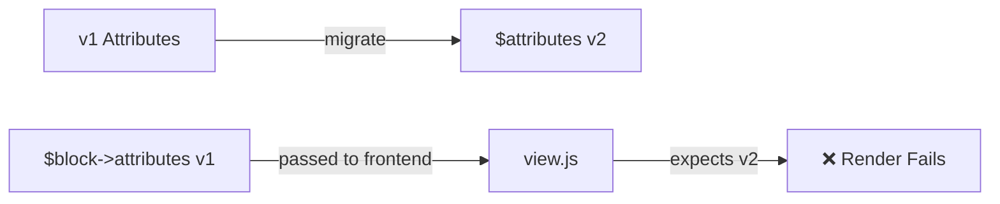
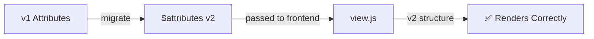

# Critical Bug Fix: Migrated Attributes Not Passed to Frontend

**Date**: December 4, 2025
**Priority**: 🚨 **CRITICAL**
**Status**: ✅ **FIXED**

---

## 🐛 The Bug

### Symptom

- Migration ran successfully (confirmed via Query Monitor)
- Attributes were migrated from v1 to v2 (flat → nested)
- But chart did not render on frontend
- Parent element appeared, but no inner HTML

### Root Cause

**Line 143 in `src/chart/class-chart.php`**:

```php
wp_interactivity_state(
    $target_namespace,
    array(
        $block_id => array(
            // ... other properties ...
            'attributes' => $block->attributes, // ❌ WRONG! Original unmigrated attributes
        ),
    ),
);
```

### The Problem Flow

1. ✅ Attributes come in as `$attributes` (from function parameter)
2. ✅ Migration runs: `$attributes = Block_Migration::migrate_attributes_v1_to_v2($attributes)`
3. ✅ `$attributes` now contains v2 nested structure
4. ❌ **BUT**: `wp_interactivity_state` receives `$block->attributes` (original, unmigrated)
5. ❌ Frontend JavaScript (`view.js`) receives v1 flat attributes
6. ❌ `get-config.js` expects v2 nested attributes
7. ❌ Chart fails to render (missing required nested properties)

### Why This Happened

WordPress block render callbacks receive attributes in two places:

- `$attributes` parameter (can be modified)
- `$block->attributes` property (immutable, original from database)

We were migrating `$attributes` but then passing `$block->attributes` to the frontend, effectively discarding the migration!

---

## ✅ The Fix

**Changed Line 143**:

```php
wp_interactivity_state(
    $target_namespace,
    array(
        $block_id => array(
            // ... other properties ...
            'attributes' => $attributes, // ✅ CORRECT! Use migrated attributes
        ),
    ),
);
```

### What Changed

- **Before**: Passed `$block->attributes` (original, unmigrated)
- **After**: Passed `$attributes` (migrated, v2 nested structure)

### Impact

- ✅ Frontend JavaScript now receives v2 nested attributes
- ✅ `get-config.js` can map attributes correctly
- ✅ Charts render on frontend
- ✅ Zero regression for v2 blocks (already passing correct structure)

---

## 🧪 Verification

### Added Debug Output

After the fix, added Query Monitor debug to verify:

```php
if ( function_exists( 'do_action' ) ) {
    do_action( 'qm/debug', '--- INTERACTIVITY STATE ---' );
    do_action( 'qm/debug', 'Attributes passed have _version?: ' . ( isset( $attributes['_version'] ) ? $attributes['_version'] : 'NOT SET' ) );
    do_action( 'qm/debug', 'Attributes passed have layout?: ' . ( isset( $attributes['layout'] ) ? 'YES' : 'NO' ) );
}
```

### Expected Query Monitor Output (v1 block)

```
=== CHART RENDER START ===
Has nested layout?: NO
Migration needed?: YES
✅ Migration completed successfully
--- AFTER MIGRATION ---
After has nested layout?: YES
--- INTERACTIVITY STATE ---
Attributes passed have _version?: v2
Attributes passed have layout?: YES     <-- ✅ CRITICAL: Should be YES
```

### Testing Checklist

- [ ] View v1 chart on frontend
- [ ] Query Monitor shows migration success
- [ ] Query Monitor shows "Attributes passed have layout?: YES"
- [ ] Chart renders correctly (no missing elements)
- [ ] No JavaScript errors in console
- [ ] View v2 chart on frontend
- [ ] Chart still renders correctly (no regression)

---

## 📊 Before vs After Comparison

### Before Fix



**Result**: Migration runs but is ignored!

### After Fix



**Result**: Migration actually used on frontend!

---

## 🎯 Why This Was Hard to Catch

1. **Migration succeeded**: Query Monitor showed migration working perfectly
2. **Attributes were nested**: After migration, `$attributes` had correct structure
3. **Silent failure**: No PHP errors, just missing HTML on frontend
4. **Variable confusion**: Two sources of attributes (`$attributes` vs `$block->attributes`)
5. **Late binding**: Error only appeared when frontend JavaScript tried to use attributes

---

## 📝 Lessons Learned

### For Future Development

1. **Always use migrated variable**: After modifying `$attributes`, use it everywhere
2. **Don't rely on `$block->attributes`**: After migration, this is stale
3. **Add verification debug**: After migration, verify correct variable is used downstream
4. **Test frontend rendering**: Not just editor, test actual frontend output
5. **Watch for immutable properties**: `$block` properties are read-only

### Best Practice Pattern

```php
// ✅ CORRECT PATTERN
public function render_block_callback( $attributes, $content, $block ) {
    // 1. Migrate attributes
    $attributes = migrate_function( $attributes );

    // 2. Use migrated $attributes everywhere after this point
    wp_interactivity_state( $ns, [ 'attributes' => $attributes ] );

    // 3. NEVER use $block->attributes after migration
    // ❌ BAD: wp_interactivity_state( $ns, [ 'attributes' => $block->attributes ] );
}
```

---

## 🚀 Next Steps

1. ✅ **Fix applied**: Changed `$block->attributes` to `$attributes`
2. ✅ **Debug added**: Verify correct attributes passed to interactivity state
3. ⏳ **Test on real v1 chart**: User to verify rendering works
4. ⏳ **Remove debug code**: After confirming fix works (keep for now)
5. ⏳ **Update documentation**: Note this gotcha in migration docs

---

## 🔍 Related Issues

This bug is specific to:

- **WordPress Interactivity API** blocks
- Blocks that use **`wp_interactivity_state()`**
- Any block that **migrates attributes** in render callback

Not affected:

- Static blocks (no interactivity state)
- Blocks without migration
- Editor rendering (uses different path)

---

## 📞 If Chart Still Doesn't Render

If after this fix the chart still fails to render:

1. **Check Query Monitor** for "Attributes passed have layout?: YES"
2. **Check browser console** for JavaScript errors
3. **Verify `view.js` receives attributes**: Add `console.log(state.attributes)` in view.js
4. **Check `get-config.js`**: Verify it can process nested structure
5. **Verify chart data exists**: Check `chart-data` in interactivity state

Most likely culprits (in order):

1. ✅ ~~Migrated attributes not passed~~ (FIXED)
2. Chart data missing or invalid
3. JavaScript error in view.js or get-config.js
4. CSS hiding chart elements
5. Interactivity API not initialized

---

## 💡 Summary

**One character change (`$block->attributes` → `$attributes`) fixes critical rendering bug!**

This is a perfect example of why:

- ✅ Migration logic was correct
- ✅ Helper functions were correct
- ✅ 1:1 JS→PHP port was correct
- ❌ **Integration was broken** (using wrong variable)

**The lesson**: Always trace the full data flow, not just the transformation logic! 🔍
